# 逆向工程实践记录： {游戏资源文件结构分析 （一）}

- [逆向工程实践记录： {游戏资源文件结构分析 （一）}](#逆向工程实践记录-游戏资源文件结构分析-一)
  - [0x00 目的概述](#0x00-目的概述)
  - [0x01 目标对象](#0x01-目标对象)
  - [0x02 前期准备](#0x02-前期准备)
    - [初步观察与假设](#初步观察与假设)
    - [思路整理](#思路整理)
  - [0x03 分析步骤详解](#0x03-分析步骤详解)
    - [熵分析](#熵分析)
    - [导入表反向追踪](#导入表反向追踪)
    - [DrawStringAt() 反向回溯](#drawstringat-反向回溯)
    - [动态调试问题解决](#动态调试问题解决)
  - [0x04 总结与下一步规划（AI写的）](#0x04-总结与下一步规划ai写的)
    - [核心成果](#核心成果)
    - [经验总结](#经验总结)
    - [后续计划](#后续计划)

> 日期：2025-08-03  
> 作者：ShiYuan Li  
> 分析平台：Voidraw OS v1.1 (Based on Ubuntu)  
> 运行平台：Windows 11 Pro (虚拟机 VMware Workstation)  
> 工具链：IDA Pro 9.1、x64dbg  
> 难度：8.5/10 (AI评的难度)

---

## 0x00 目的概述

- 分析目标程序的文字资源文件 “.WAR”的结构
- 修改程序最终文字显示结果
- 编写简单的打包/解包程序
- 挑战：禁用反反调试插件，靠自己去解决问题

## 0x01 目标对象

> 概述：目标对象为一个单机文字RPG游戏程序。

- 架构：x86 （32位）
- 加壳：高度疑似VMP加密，或其他定制壳，多种混淆手段

原文件以文本形式加密附于项目中，本文仅描述思路，不直接提供程序文件(**AES256、{key: SHA-256-YJYBigSB}**)。

## 0x02 前期准备

### 初步观察与假设

> 游戏启动后，从同一目录下的“.WAR”文件中读取游戏资源，可能包括音乐、美术资源、文字资源、演出逻辑等。 

> 如[图1](#p00)所示，根据导入表分析，该程序依赖于gdi32.dll，但未见DirectX或OpenGL相关依赖，故而推测该程序依赖GDI接口进行绘图。

<a name="p00"></a>
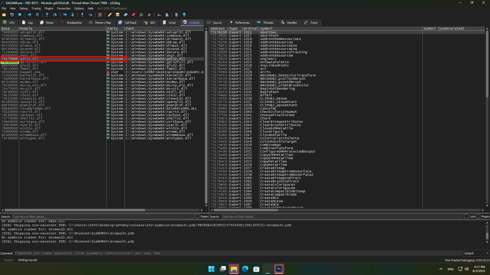

### 思路整理

从本次逆向分析的目的出发，结合初步的假设（程序使用GDI绘图），不难思考出两条可行的基本路径。

1. 从文字显示逻辑处反向回溯，追踪用于显示的字符串，最终找到生成解码后文字的逻辑，由其分析出资源文件结构。
2. 从文件操作系统调用开始，追踪文件句柄，找到读取文件的逻辑，观察程序如何处理从文件中读取到的数据。
   
此次逆向分析目标的运行平台为Windows，接口为GDI，故而用于文字显示的系统接口主要包括**GetGlyphOutline**、**TextOut**，这两个函数是此次逆向分析的重要锚点。此外，Windows平台中的文件操作API包括**CreateFile**、**ReadFile**、**WriteFile**。

## 0x03 分析步骤详解

### 熵分析

对资源文件进行熵分析可以判断资源文件是否被加密或压缩，虽然这不能直接判断文件结构，但可以对后续的分析提供一定的思路。 

Linux下，常用ent工具进行熵分析，其可以用下面的指令安装。

```sh
sudo apt install ent
```

普通文本文件的熵值通常在4-5之间，如果熵值接近8（>7），则说明文件很有可能被加密或压缩。

<a name="p01"></a>
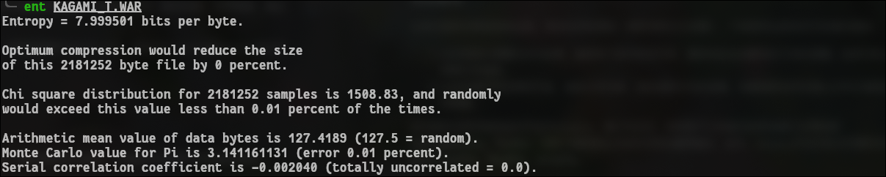

根据[图2](#p01)中的测试结果，资源文件的熵值都非常接近8,故而推测他们是被压缩或加密的。

### 导入表反向追踪

在IDA Pro中打开目标程序后，在Imports中找到函数**GetGlyphOutlineA**，对其进行交叉引用搜索。

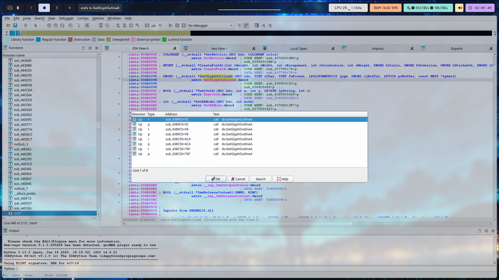

从图中的结果可知，主要有两个函数引用了**GetGlyphOutlineA**，它们的起始地址分别是**4389C0H**和**438C50H**。

这两个函数的签名如下：

```C
int __cdecl sub_438C50(int, BOOL hdc, int x, int y, ULONG_PTR lpString, int c);
int __cdecl sub_4389C0(int, SYSTEMTIME lpgm, UINT_PTR uChar);
```

根据交叉引用图分析判断，**sub_4389C0**仅被**sub_438C50**显式调用，而**sub_438C50**同时调用了**TextOutA**和**GetGlyphOutlineA**，并且是**GetGlyphOutlineA**的唯一调用源。

并且**sub_438C50**的函数签名中包含一个字符串指针参数、一个绘图句柄以及疑似坐标的两个整数，这是非常值得注意的一个点。

| **sub_4389C0** | **sub_438C50** |
|-----|-----|
| 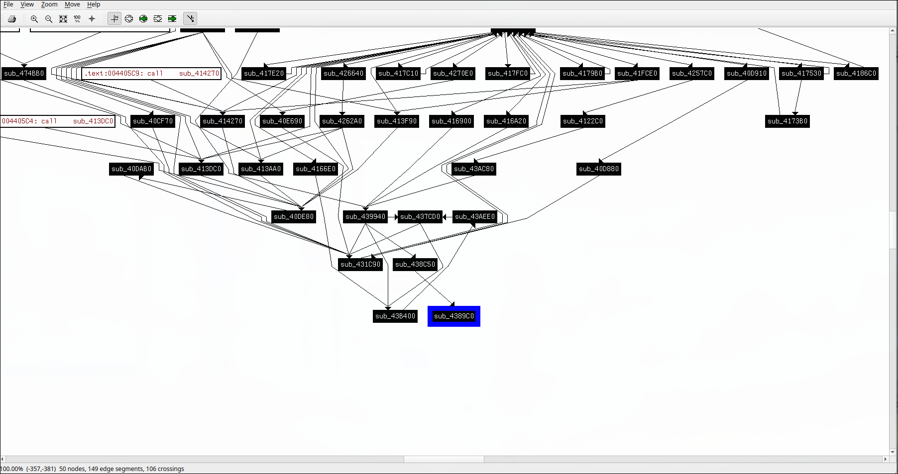 | 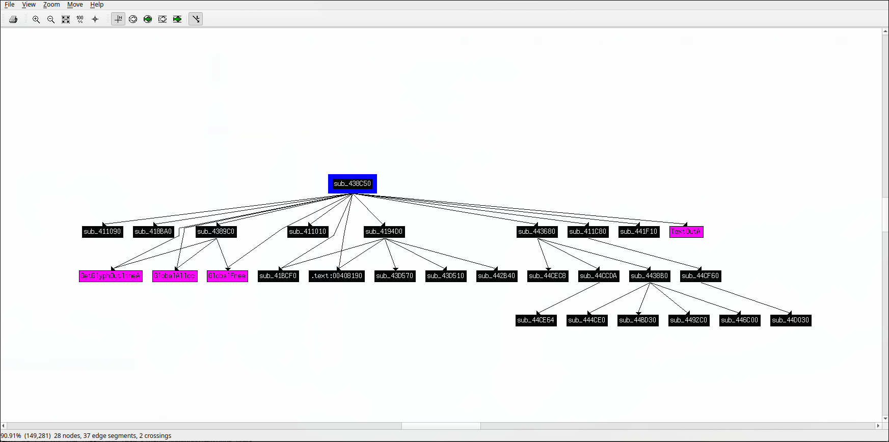 |

> 由此推测，**sub_438C50**函数的功能为在指定位置绘制字符串，将其重命名为 **“DrawStringAt()”**。

### DrawStringAt() 反向回溯

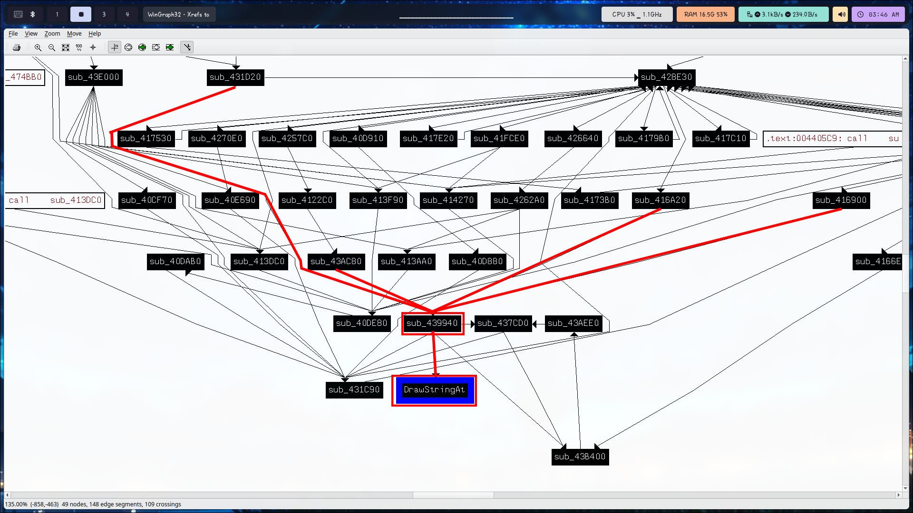

根据交叉引用图分析，DrawStringAt的唯一调用者为**sub_439940**，签名如下：

```C
void __cdecl sub_439940(int c, HDC hdc, int);
```

如下图所示，对**sub_439940**进行反汇编分析发现，在这个函数的末尾，一个短时的**Sleep**会被无条件执行：

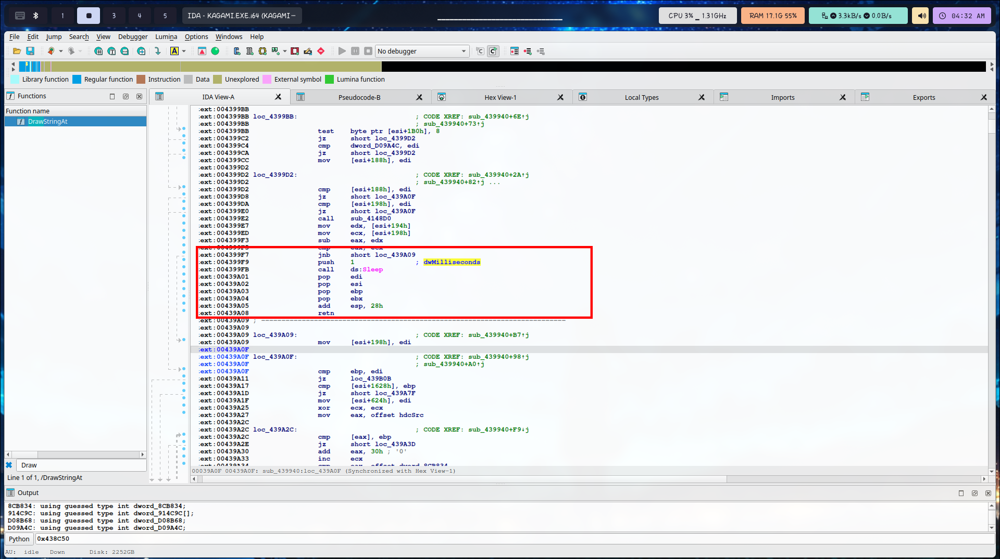

这一点很值得注意，因为此类操作的意义通常是临时交出CPU控制权，避免长时间占死某个CPU核心。那么这说明**sub_439940**具有什么特征呢？首先，它没有等待IO操作，事件，信号或者Windows Message一类的东西，因为这类等待并不是锁死在CPU上忙等待的，而是通过OS调度来实现，其次，**这个函数很可能需要被高频循环调用**，进一步说，它可能就是在某个线程中被死循环调用的，所以才需要在一次调用结束后用**Sleep**交出CPU控制权。

再进一步分析，什么样的功能需求会产生这样的设计？有很多，但是在这里可以根据经验猜两个可能性比较高的。

1. 这个函数是整个图形应用的消息循环处理器
2. 这个函数是游戏引擎的Tick事件处理器

而在这两个猜测中，我比较偏向于猜想(1)，因为这个函数特别大并且逻辑复杂，当然也不能排除这是因为编译器把很多子例程内联了进去，这些问题还要进一步研究。

那么来验证一下上面进行的诸多猜想。一个简单的方法是用动态调试器，打上一个日志断点，观察函数的调用来源。

### 动态调试问题解决

在动态调试过程中遇到了一些小问题，目标程序如果独立运行就没有问题，但如果用调试器附加就会闪退。其实很多原因都能引起这个问题，有的简单有的复杂。但如果想找到问题的根源，通常第一步就是**仔细观察这个程序到底是以什么形式退出的**，是Crash还是Terminate、或者说它自己选择退出。

首先，在EntryPoint和WinMain上打断点，然后一路Continue，程序再次出现闪退问题后查看Log。

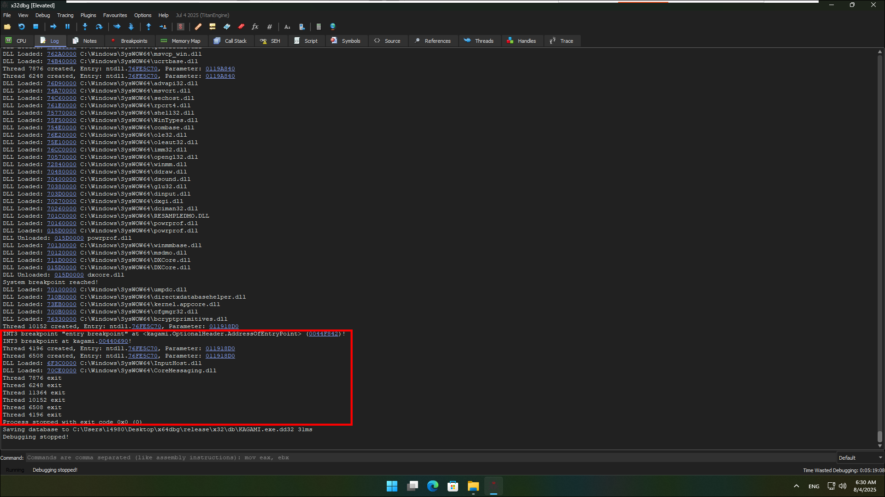

从这个Log中能获取到很多信息：

1. EntryPoint和WinMain函数确实被执行。
2. 并没有发生明显的Crash，程序很有可能是自己退出的。

在上面这两个信息的驱动下，其实就可以直接去研究WinMain函数本身了。因为start引用WinMain，既然程序是自己退出的，十有八九就是WinMain自己返回了。果不其然，往下拉一拉就能发现作者耍的”小聪明“。

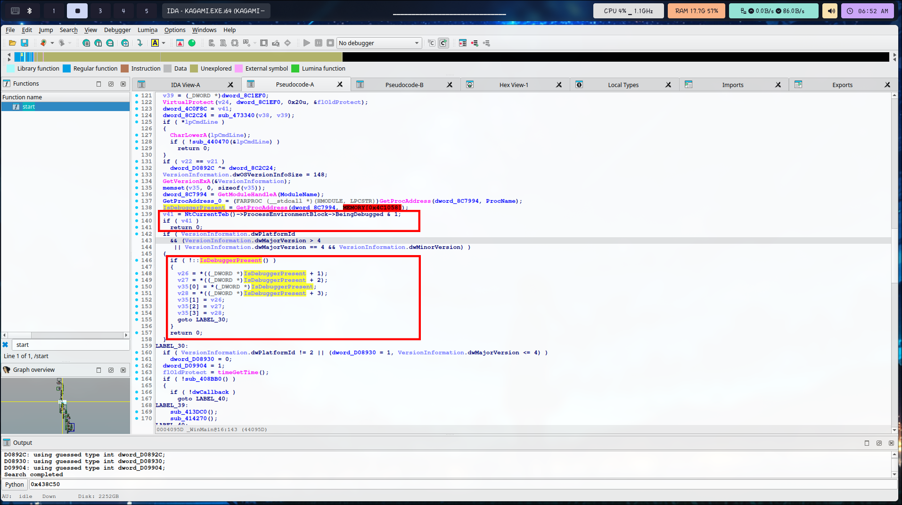

那对付这种程度的反调试，直接把对应的分支指令Patch掉就好了。

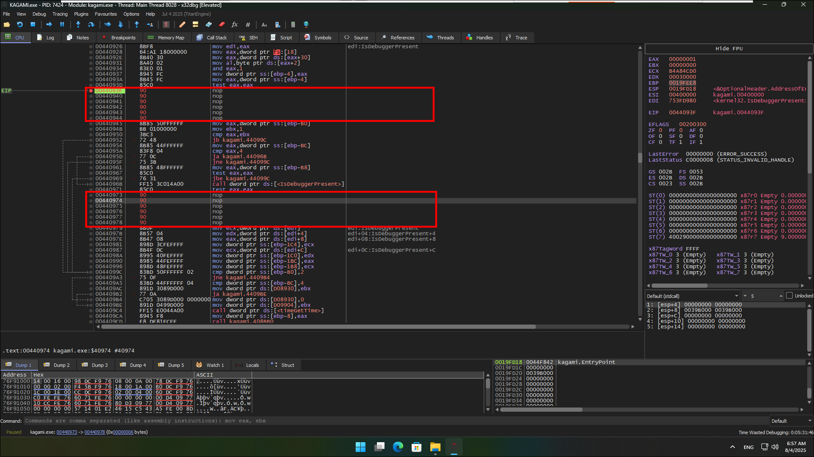

但是随后出现了另一个问题，就是程序报”Initialization failed“，独立运行程序时同样没有这个问题。我的第一反应是，由于我Patch掉了反调试的分支跳转指令，所以导致一些关键的初始化步骤被跳过，然而目前没有证据或迹象驱动这个方向的分析。

那么目前就有两种猜测：

1. 这个作者在某个子过程中又加了一次反调试，没有被我Patch掉，但检测到就说是初始化失败。
2. 确实是一些目前位置的调试器相关的原因，引起了初始化失败。

但无论如何，罪魁祸首多半就是**sub_408BB0**返回了错误的结果，对其进一步分析可以发现，**sub_408BB0**申请了一块可执行的内存，并将起始地址传入了子过程**415720H**。  


进入415720H处的子过程后，首先扑面而来的就是毫不掩饰的干扰反汇编的花指令。

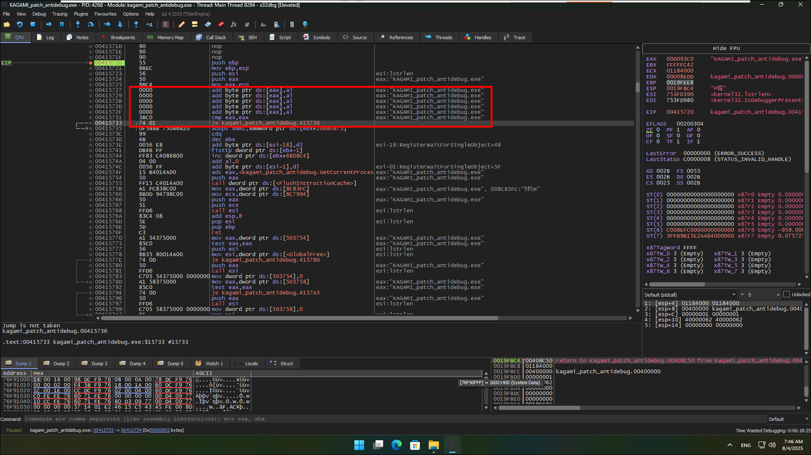

从指令字节中可以很明显看到，程序在进行了一系列无实际意义的操作后，用cmp指令确保ZF标志为1，然后用je指令跳转到0x415736。如果从头顺序解释的话，这个地址应该是两条指令的中间，很显然这个地方才是真正的指令边界，我们直接编辑内存，把前面的无意义操作替换为nop。

| **清除花指令过程** | **清除后的代码** |
|-----|-----|
| 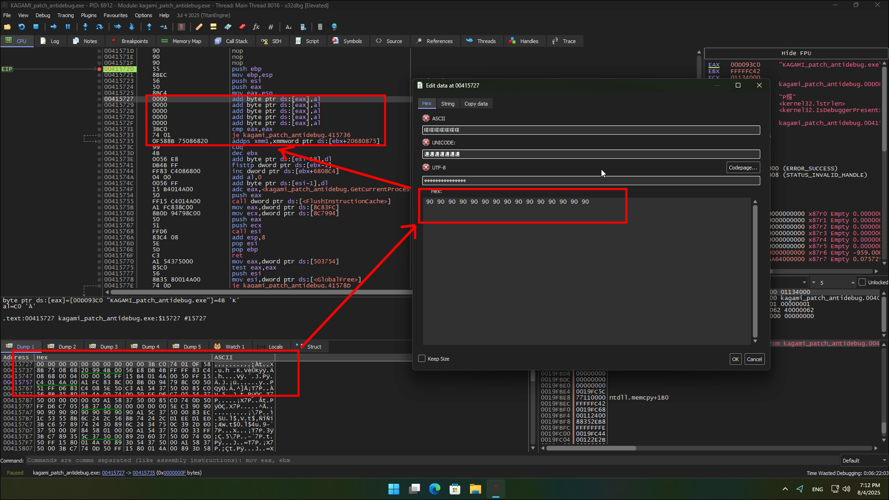 | 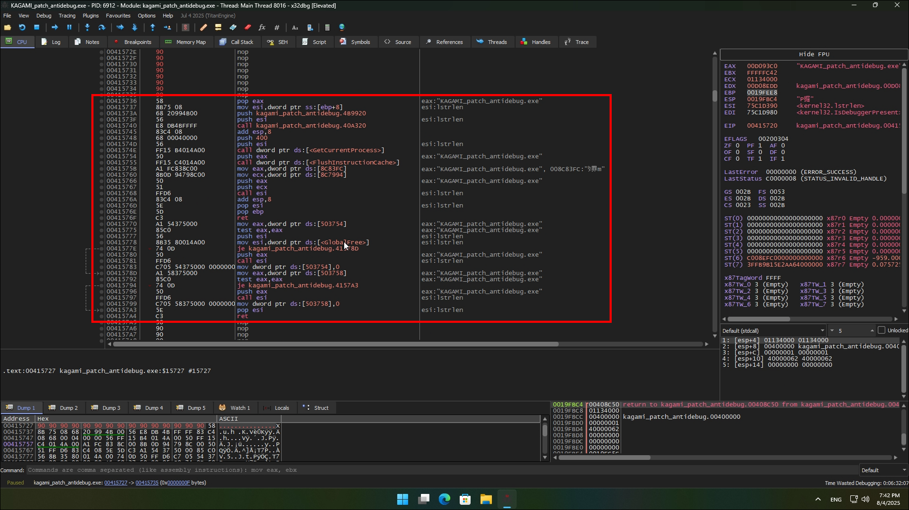 |

重新分析二进制代码，可以发现**415720H**处的子过程引用了之前申请的可执行内存，以及另一块静态数据。

其实到了这一步，局面已经比较清晰了，那就是这个程序极其有可能使用了类似于VMP的加密壳保护自己的一些逻辑。为了进一步验证这一猜测，我们等**40A320H**处的解密释放程序执行完成后，跟进到esi指向的地址。

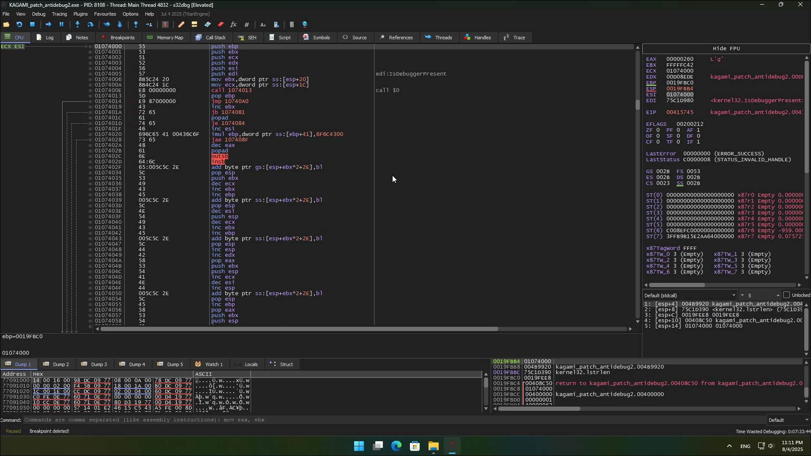

**对味了！对味了！**

那么在这种情况下，继续和这一坨东西硬碰硬，去尝试拆分逻辑、Dump，性价比就非常低。不妨釜底抽薪，让这段严防死守的代码所依赖的调试器检测接口不再可靠。恰巧，x64debug里面就提供了这样的一个方便的指令：

> dbh hide

这条指令可以让反调试依赖的常规接口，比如PEB+BeingDebugged、IsDebuggerPresent失效，从而绕过。

但是这一次，如果你认为问题到这就解决了，那就会感受到软件作者从2014年给你送过来的“恶意”。

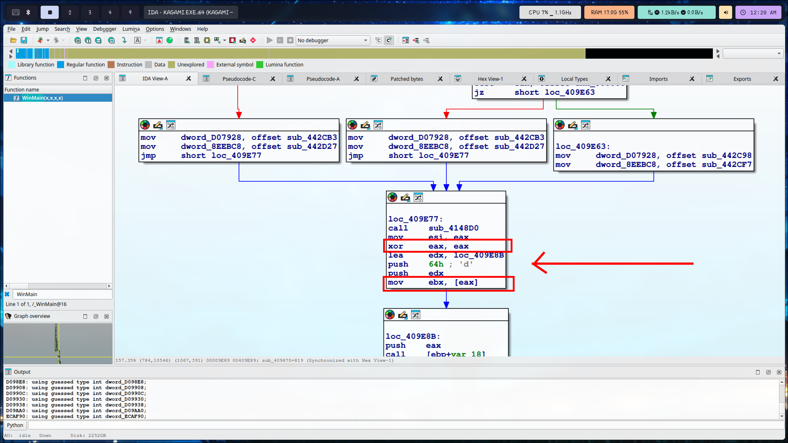

像上面这种手段，我的评价是伤害一般，含史量较高。非常明显，这就是有意的在代码中触发异常，给你的调试器喂史。

可能你会想，“这怎么还伤害一般呢？这哪有伤害啊？我把这一句代码Patch掉不就行了“，但是这就错了。因为作者会把一部分代码逻辑放到SEH里面，如果你把这个引发异常的空指针解引用Patch掉，那后面的代码就会直接罢工。

所以在这种情况下，效率最高的一种方案就是让调试器不要去管这个异常，同时也不要去干扰SEH。

**但是，但是又来了**，如果你感觉到这里就结束了，那作者又对你微微一笑 :)。为什么呢？因为他在SEH里面又塞了一个调试器检测：

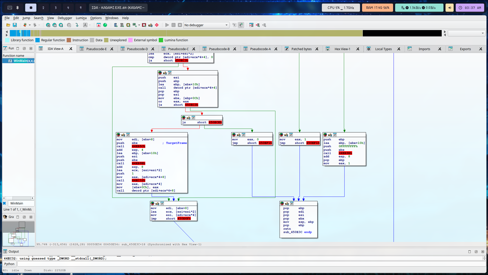

这个逻辑还是很”简练“的，某个子过程中调用了一个我现在没兴趣去研究做了什么的函数，然后根据函数的返回值去迭代，迭代过几轮之后，如果满足某个条件，就让这个SEH过程返回0，否则返回1。

那很显然，这个程序的行为就是故意去解引用一个空指针，然后在SEH里面检测调试器。如果检测到就把异常传递到OS层面，否则就继续执行。

那么这一次，作者又用了什么手段呢？只能再继续跟进去看看了。

顺带一提，这种情况下，你想直接在IDA里画交叉引用图一般是没戏的，因为作者在搞这种操作的时候不会把一个静态的地址放在那里直接call，就像下面这样：

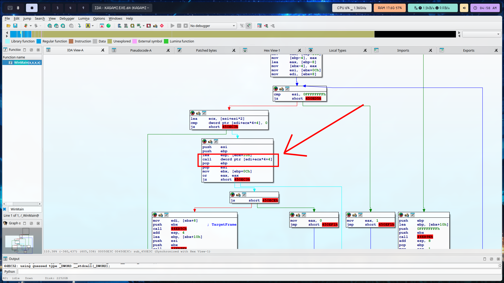

我们只能用动态调试去跟踪到这个位置，观察实际的call地址后再到IDA中分析：

| **跟踪动态调用** | **函数入口点** |
|-----|-----|
| 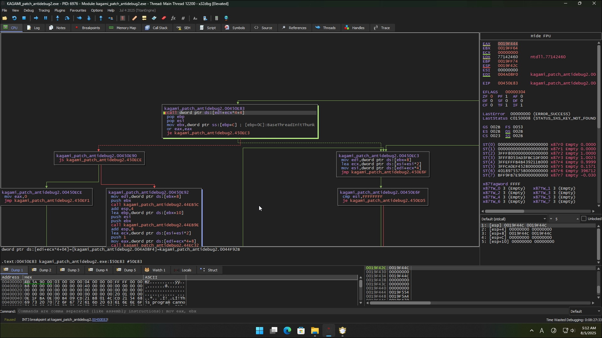 | 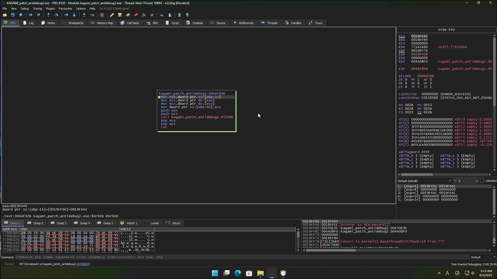 |

到这一步之后，就可以再次回到IDA中，用交叉引用图去揪出捣鬼的家伙了。

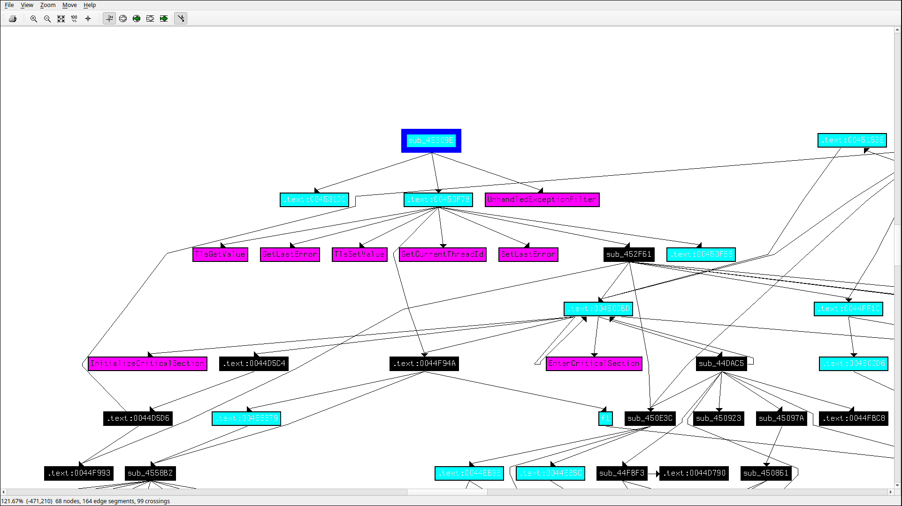

上面这张交叉引用图乍一看，最显眼的就是这个**UnhandledExceptionFilter**，这个函数通常是当一个异常没有被任何捕获机制成功处理时，由OS自动调用的，用户代码主动去call是一个反常现象。

作者这样操作的意图其实也不难猜，其中一种动机是他用**SetUnhandledExceptionFilter**设置了一个顶层的处理过程，然后在那个过程中又塞了一个调试器检测，但是在这个程序中，**SetUnhandledExceptionFilter**从来没有被调用过，并且跟踪**UnhandledExceptionFilter**的后续流程可以发现，EIP马上转到了kernelbase.dll的上下文中，这是Windows默认的顶层异常处理函数所在的区域，所以这个猜测可以被否定了。

另一种动机就需要一些反调试经验，或者对Windows底层原理有比较细节的了解才能想到了，我们不妨来看一看MSDN的官方文档（url：https://learn.microsoft.com/en-us/windows/win32/api/errhandlingapi/nf-errhandlingapi-unhandledexceptionfilter）：

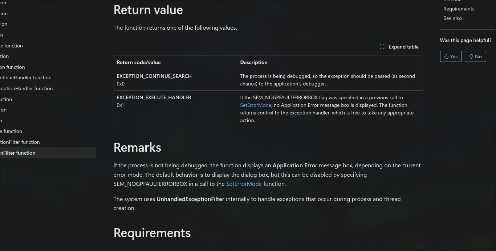

你看这上面说，**UnhandledExceptionFilter**在什么情况下会返回0啊？ **“The process is being debugged, so the exception should be passed (as second chance) to the application's debugger.”**——被调试的时候。

根据MSDN的说法，**UnhandledExceptionFilter**在没有调试器附加时会返回1，那我们能不能直接把这个call指令Patch成 **“mov eax, 1”** 呢？

> 看似合理，实则不行。

因为UnhandledExceptionFilter返回1的情况是操作系统直接弹出一个报错框，然后把这个进程终止掉。程序作者肯定不会让调试器检测系统在程序正常运行时把他搞崩溃，没错吧？所以他会用**SetErrorMode**来将这个进程的错误处理模式设置成**SEM_NOGPFAULTERRORBOX**，在这种情况下，UnhandledExceptionFilter的返回值是 **-1(EXCEPTION_CONTINUE_EXECUTION)**，而不是**1(EXCEPTION_EXECUTE_HANDLER)**。

并且，**UnhandledExceptionFilter**的内部逻辑会让SEH记录的断点信息改变，所以这里最合适的做法是Hook一个Nt函数**NtQueryInformationProcess**，让这个函数的输出信息不包括调试器信息。

到这里为止，作者就没再搞什么花活了。程序顺利在调试器下运行。

## 0x04 总结与下一步规划（AI写的）

### 核心成果
1. **文件分析**  
   - 确认.WAR文件被加密/压缩（熵值≈8）  
   - 定位关键函数`DrawStringAt()`及其调用链

2. **反调试突破**  
   - 绕过三层防护：
     - 静态检测（Patch分支）
     - 动态干扰（清花指令）
     - SEH滥用（Hook系统API）
   - 实现稳定调试环境

### 经验总结
- 系统API深度理解是关键
- 动态/静态分析需交替验证
- 加密壳分析需要更多技巧

### 后续计划
1. 逆向.WAR解密算法  
2. 开发资源修改工具  
3. 研究游戏主循环逻辑  